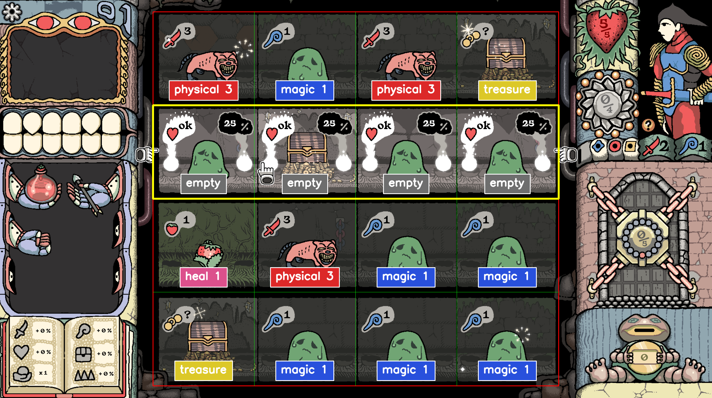
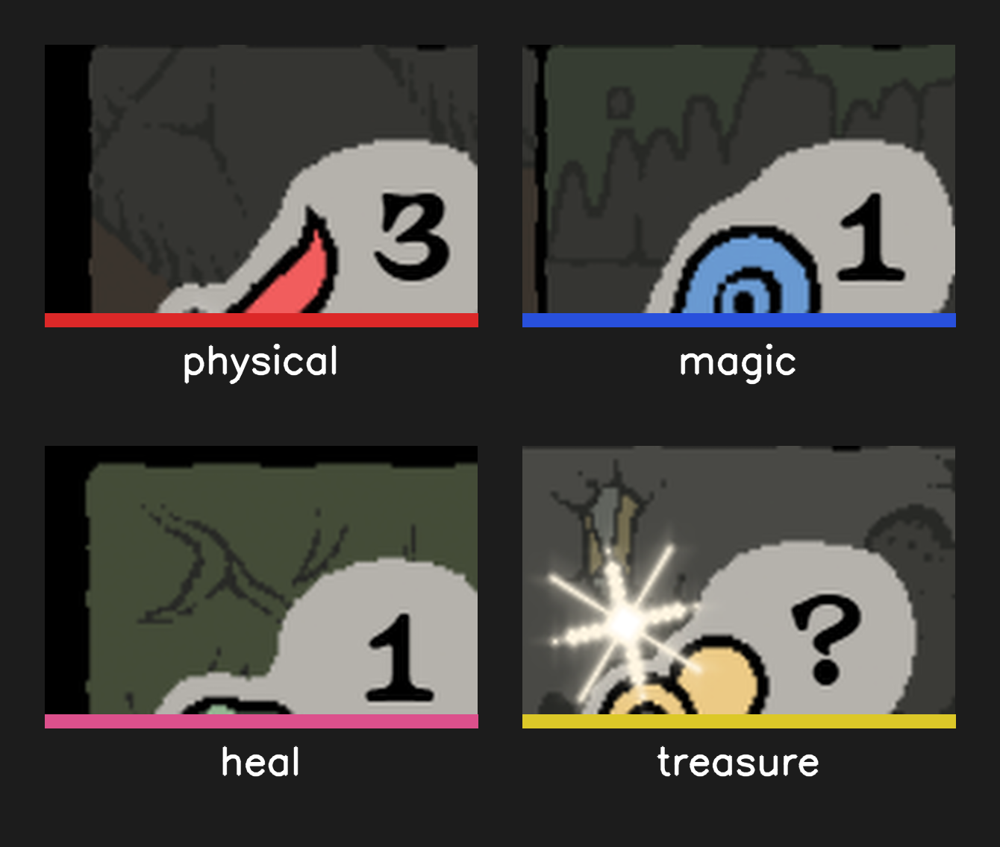

<div align="center">

# Sol Cesto Solver

### *Reads the board. Picks the safest row. No neural nets.*

A computer-vision assistant for [**Sol Cesto**](https://store.steampowered.com/app/2738490/Sol_Cesto/),
the Mesoamerican-flavoured roguelite by Goblinz Studio. It captures the game
window, recognises what each tile means, and tells you **which row gives you
the smallest expected loss of HP**. Built with OpenCV template matching and a
plain expected-value calculator — no training, no GPU, ~0 ms per cell, fully
deterministic.

[](https://github.com/JulenGod/solcesto_solver/actions/workflows/ci.yml)
[](https://www.python.org/)
[](https://opencv.org/)
[](https://docs.pydantic.dev/)
[](https://python-poetry.org/)
[](#requirements)
[](LICENSE)

</div>

---

## 📸 Demo

<p align="center">
  
</p>

What you're looking at: a captured frame from the game, with each cell's
**detected badge classification** drawn as a coloured chip (🔴 physical,
🔵 magic, ❤️ heal, 🟡 treasure, ⚫ empty) and the **recommended row**
outlined in yellow. Generated by:

```powershell
poetry run sol-cesto-solver --from-file tests/fixtures/screenshot.png --debug
```

> **Why does row 1 read as `empty`?** This frame was captured while the
> player was hovering row 1, so Sol Cesto's in-game "ok ♥" preview overlay
> covers those tiles' badges. The detector honestly reports `empty` because
> it can't see through the overlay. In production, take captures without
> hovering. More in [Known limitations](#-known-limitations).

The same command without `--debug` prints (abridged):

```json
{
  "state": {
    "board": [
      [
        {"content": "physical",  "value": 3},
        {"content": "magic",     "value": 1},
        {"content": "physical",  "value": 3},
        {"content": "treasure",  "value": null}
      ],
      [ {"content": "empty"}, {"content": "empty"}, {"content": "empty"}, {"content": "empty"} ],
      [
        {"content": "heal",      "value": 1},
        {"content": "physical",  "value": 3},
        {"content": "magic",     "value": 1},
        {"content": "magic",     "value": 1}
      ],
      [
        {"content": "treasure",  "value": null},
        {"content": "magic",     "value": 1},
        {"content": "magic",     "value": 1},
        {"content": "magic",     "value": 1}
      ]
    ],
    "player": {"hp": 5, "max_hp": 5, "sword": 2, "magic": 1},
    "gold": 0,
    "door": {"cleared": 0, "required": 5}
  },
  "recommendation": {
    "best_row": 1,
    "rows": [
      {"row": 0, "expected_hp_change": -0.5,  "worst_case_hp_change": -1.0, "cells": [...]},
      {"row": 1, "expected_hp_change":  0.0,  "worst_case_hp_change":  0.0, "cells": [...]},
      {"row": 2, "expected_hp_change": -0.25, "worst_case_hp_change": -1.0, "cells": [...]},
      {"row": 3, "expected_hp_change":  0.0,  "worst_case_hp_change":  0.0, "cells": [...]}
    ]
  }
}
```

Translation: *"row 0 will cost you about half a heart on average and one heart
in the worst case; rows 1 and 3 are safe; pick row 1."*

---

## ✨ What it does

Sol Cesto is a roguelite played on a 4×4 grid. Each turn you choose a **row**;
your character lands with equal probability (¼) on one of the four tiles in
that row, resolves whatever's there (a monster, a heal, a treasure, an empty
square), and you keep going. The interesting question every turn is:

> *Which row minimises my expected HP loss?*

This project answers it automatically:

```
Sol Cesto (live window)
        │
        ▼ mss screenshot
   BGR image
        │
        ▼ detect_board   (heuristic proportions)
   4×4 GridLayout
        │
        ▼ cv2.matchTemplate   (badge icons + digits)
   GameState  (pydantic)
        │
        ▼ recommend_row   (expected value per row)
   Recommendation
        │
        ▼
   { state, recommendation }   JSON on stdout
```

Alongside the board it also tracks the run-level counters on the right panel:
**gold** (the frog's number) and the **door / exit progress** (`cleared` of
`required` tiles — the "0/5" badge). Both are best-effort and need the side
panel on screen.

Cells are classified by their **badge** (the small icon in the corner of the
tile), not by the underlying creature sprite. Sprites animate and vary; badges
are static UI and always mean the same thing:

| Badge          | `content`   | What it means                                |
|----------------|-------------|----------------------------------------------|
| 🔴 red sword   | `physical`  | Monster — clears safely if `player.sword ≥ value` |
| 🔵 blue wand   | `magic`     | Monster — clears safely if `player.magic ≥ value` |
| ❤️ red heart   | `heal`      | Heals `value` HP, capped at the room to `max_hp`  |
| 🟡 gold `?`    | `treasure`  | Unknown reward (chest / gold pile / item)         |
| —              | `empty`     | Nothing on this tile, *or* tile is hidden by a hover-preview overlay |

<p align="center">
  
</p>

That model is what makes the solver **robust to new content**: any new monster
the game throws at you classifies correctly as `physical` or `magic` without
re-extracting templates, as long as its badge is one of the four we know.

---

## 🎯 Why template matching (and not a CNN)

| Approach                 | Why not here                                                        |
|--------------------------|---------------------------------------------------------------------|
| YOLO / a trained CNN     | Needs a labelled dataset, training time, a GPU, and is less precise on pixel-art |
| Tesseract / EasyOCR      | Fragile on stylised small digits, brings heavy dependencies         |
| **OpenCV template matching** | Zero training, ~0 ms per cell, **100% reproducible** ✓          |

Sol Cesto's art is pixel-perfect and deterministic — there is no smarter tool
for the job. The point of the project isn't to use the shiniest model; it's to
pick the right tool and execute well.

---

## 🪟 Requirements

- **Windows 10/11** (live capture uses `pygetwindow`, which only works on Windows).
  The recognition + decision modules are platform-agnostic and run anywhere
  with the CLI's `--from-file` flag.
- **Python 3.12+**.
- **[Poetry](https://python-poetry.org/docs/#installation)** for dependency
  management.
- A running copy of Sol Cesto, *or* a saved PNG of a board.

---

## 🚀 Quick start

```powershell
# 1. Clone and install
git clone https://github.com/JulenGod/solcesto_solver.git
cd solcesto_solver
poetry install

# 2. (Optional) seed starter templates from the bundled sample screenshot
poetry run python scripts/bootstrap_icons_from_screenshot.py

# 3. Run against the bundled sample
poetry run sol-cesto-solver --from-file tests/fixtures/screenshot.png

# 4. Or capture the live game window
poetry run sol-cesto-solver
```

> The `.venv/` lives inside the project (`virtualenvs.in-project = true` in
> `poetry.toml`), so IDEs auto-detect the interpreter.

---

## 🖥️ CLI reference

```
sol-cesto-solver                        Live capture -> JSON {state, recommendation}
sol-cesto-solver --from-file shot.png   Analyse a saved PNG instead
sol-cesto-solver --watch 2              Re-capture every 2 seconds
sol-cesto-solver --debug                Also write debug-grid.png with the grid overlaid
sol-cesto-solver --window "Sol Cesto"   Override the game window title to find
sol-cesto-solver --mimic-chance 0.2     Penalise treasure cells (late-game mimics)
sol-cesto-solver --overlay              Live click-through overlay over the game (Windows)
sol-cesto-solver --sword 2 --magic 1    Override detected player stats (if OCR misreads)
sol-cesto-solver --mod-physical 30      Set a book modifier (+30% physical landing bias)
```

Detection adapts to the window size automatically (templates are matched at
multiple scales) and runs DPI-aware, so it works on scaled displays. The whole
game window — including the right-hand HP / sword / magic panel — must be on
screen for stats to be read; if it isn't, pass `--sword`/`--magic`/`--max-hp`.

Errors land on stderr; the JSON output on stdout is always parsable.

---

## 🪟 Live overlay

```powershell
poetry run sol-cesto-solver --overlay
```

Opens a frameless, always-on-top, **click-through** window that frames the
detected board, highlights the recommended row, labels every cell with its
detected content + value, and shows a HUD panel (HP / sword / magic, gold, door
progress and tiles remaining, book modifiers, per-row expected HP). It's a
live read-out of *everything* the detector sees, so you can verify at a glance
that it's reading the board correctly. Refreshes once a second (tune with
`--watch`); being click-through, mouse input passes straight to the game — the
overlay never blocks play.

Two practical requirements on Windows:

- Run Sol Cesto **windowed** or **borderless windowed**. Exclusive fullscreen
  bypasses the desktop compositor and would hide the overlay.
- Capture without hovering a row — the in-game hover preview covers the badges,
  so the hovered row reads as `empty` (see [Known limitations](#-known-limitations)).

The drawing is split for testability: the screen-coordinate math (the pure
helpers in [`overlay.py`](src/sol_cesto_solver/overlay.py)) is unit-tested,
while the thin Tkinter window itself is exercised manually with the game open.

---

## 🧮 The decision algorithm

Picking a row is a uniform lottery over its 4 cells. The expected change in HP
is the average HP delta of the four outcomes:

$$E[\Delta HP \mid \text{row}] = \frac{1}{4} \sum_{i=1}^{4} \Delta HP(\text{cell}_i)$$

where `ΔHP(cell)` depends on the badge:

| Badge       | `ΔHP(cell)`                                          |
|-------------|------------------------------------------------------|
| `physical`  | `−max(0, value − player.sword)`                      |
| `magic`     | `−max(0, value − player.magic)`                      |
| `heal`      | `+min(value, max_hp − hp)`  *(capped at room to max)* |
| `treasure`  | `−mimic_chance · ASSUMED_MIMIC_LOSS`  *(default 0)*  |
| `empty`     | `0`                                                  |

We pick the row with the largest `E[ΔHP]`. **Tiebreakers**, in order:

1. Best worst-case (more defensive — useful at low HP).
2. Lowest row index (stability across runs).

### The `mimic_chance` hyperparameter

On late levels, some "chests" are actually mimics — monsters in disguise that
only reveal themselves through an animation tell or a player-applied debuff.
We can't see that from a single frame, so the algorithm penalises every
`treasure` cell by `mimic_chance · ASSUMED_MIMIC_LOSS` (default `0` for early
levels, raise it on later levels via `--mimic-chance`).

### Landing modifiers

The flat ¼-per-cell assumption breaks once the player's book grants a landing
bias (e.g. "+30% physical"). Each cell is then weighted `1 + modifier` for its
content type and renormalised across the row, so the per-cell odds — and the
recommended row — shift. Supply them with `--mod-physical`, `--mod-magic`,
`--mod-heal`, `--mod-treasure`, `--mod-trap` (auto-reading the book is future
work). The exact in-game percentage formula is assumed additive-weight, pending
confirmation against a capture with non-zero modifiers.

---

## 🏗️ Architecture

```
src/sol_cesto_solver/
├── capture.py        Locate + grab the Sol Cesto window via mss (Windows only)
├── grid.py           Detect the 4×4 board area and crop cells
├── recognition.py    Template-match badge icons (sword/magic/heart/?) and digits
├── state.py          Pydantic models: GameState, Player, Cell
├── decision.py       Expected-value evaluation, row recommendation
├── overlay.py        Transparent click-through overlay (pure geometry + Tk window)
└── cli.py            Pipeline: capture → recognise → recommend → JSON / overlay

scripts/
├── train_capture.py                Collect changed frames while you play
├── extract_templates.py            Cut a template: pick font, drag a box, press a key
├── grab_capture.py                 Save one clean client-area frame (debugging)
└── bootstrap_icons_from_screenshot.py   Seed templates from the bundled sample

templates/
├── icons/   sword.png, magic.png, heart.png, question.png   (badge UI)
└── digits/  0–9 in three font variants (badge / hp / stat) + % and /

tests/
├── fixtures/   Sample screenshot the end-to-end test runs against
├── test_recognition.py   Grid geometry + full-pipeline smoke test
├── test_decision.py      Algorithm unit tests (17 cases)
└── test_overlay.py       Overlay geometry + panel-text helpers (7 cases)
```

---

## 🧪 Tests

```powershell
poetry run pytest -v
```

Coverage:
- Grid geometry (cell rects, crops, dimensions).
- **End-to-end smoke test** that runs the full recognition pipeline against
  the bundled screenshot and asserts known cells and player stats — any
  regression in detection or templates flips it red.
- **17 algorithm unit tests** covering every content type, the heal cap,
  the `None`-value fallback, tie-breaks, and `mimic_chance`.
- **7 overlay tests** covering the screen-coordinate math (board frame,
  recommended-row box, panel anchor) and panel-text formatting.

CI runs `ruff check` + `pytest` on every push and PR (see
[`.github/workflows/ci.yml`](.github/workflows/ci.yml)).

---

## 🧩 Extending the solver

The detector is a thin layer over template matching, so adding new content
means adding templates and (rarely) one line of mapping. There are three
extension points:

**1. A new badge appears** (e.g. a green shield for *defence*):

```powershell
poetry run python scripts/extract_templates.py path/to/your/screenshot.png
# -> drag a tight box around the icon, press 'i', name it "shield"
```

Then map it in [`recognition.py`](src/sol_cesto_solver/recognition.py):

```python
BADGE_TO_CONTENT: dict[str, CellContent] = {
    "sword": "physical",
    "magic": "magic",
    "heart": "heal",
    "question": "treasure",
    "shield": "defence",   # ← add here
}
```

…and add `"defence"` to `CellContent` in `state.py`.

**2. A new digit appears** (e.g. gold reaches "7", or the door shows "3/5"):

A single screenshot only shows a few values, so collect frames *while you play*,
then cut the digits you're missing:

```powershell
# 1. Play a training run — saves changed frames to captures/ (deduped)
poetry run python scripts/train_capture.py

# 2. Open a captured frame and cut the digit
poetry run python scripts/extract_templates.py captures/capture_0007.png
# -> press 'f' to pick the font, drag a box around the digit, press its key
```

The **font tag matters**: each readout uses its own font, so the same glyph is
saved per font — a gold "7" as `7_gold.png`, a door "3" as `3_door.png`, an HP
digit as `7_hp.png`, a stat digit as `7_stat.png`, a cell badge as `7.png`. Those
are exactly the suffixes the detector's per-font matching looks for.

**3. A whole new monster type**: nothing to do! The badge is what classifies
the cell, not the sprite.

---

## ⚠️ Known limitations

- **Preview row reads as `empty`.** When you hover a row in-game, an "ok ♥" /
  "25%" overlay covers the badges of that row's cells, so the detector can't
  read them. In practice this means *capture without hovering*. Reading the
  hovered row through that overlay is a future improvement.
- **The overlay needs a windowed game and targets the primary monitor.**
  Exclusive fullscreen hides it; multi-monitor setups currently draw on the
  primary screen.
- **Mimic chests can't be told apart from real chests in a single frame.**
  See [the `mimic_chance` section](#the-mimic_chance-hyperparameter) for the
  workaround. Frame-diff–based mimic detection is on the roadmap as Phase 5.
- **Board location uses fixed proportions of the captured image.** Templates are
  matched at multiple scales so different window sizes work, but a very unusual
  aspect ratio could still shift the grid. `--debug` writes the grid overlay so
  you can eyeball misalignment; persistent cases can hand-edit
  `~/.sol-cesto-solver/calibration.json`.
- **Stat OCR is best-effort.** Reading HP/sword/magic needs the side panel fully
  on screen and the right digit templates; when in doubt, override with
  `--sword`/`--magic`/`--hp`/`--max-hp`. The board (what each row costs) is the
  robust part; player stats are the override-friendly part.
- **HP > 9.** The HP region currently expects single-digit `current/max`
  (the fallback splits "55" → 5/5). Multi-digit HP (e.g. `12/15`) needs a
  proper `/` template and a stricter parser. The model already handles it;
  only the regex-style fallback is the constraint.
- **Sprites and badges may be re-skinned** in future game updates. Replace
  the affected templates and you're back online — no code change needed.

---

## 🗺️ Roadmap

- [x] **Phase 1** — Detect the screen, produce a `GameState` JSON.
- [x] **Phase 2** — Recommend a row via expected-value scoring (+ `mimic_chance`).
- [x] **Phase 3** — Live click-through overlay framing the board + recommended row.
- [ ] **Phase 4** — Multi-turn lookahead, potion / inventory management.
- [ ] **Phase 5** — Frame-diff mimic detection during live capture.

---

## 🇪🇸 En español, en resumen

Un script de Python que mira tu juego de **Sol Cesto** mientras juegas,
identifica todo lo que aparece en la pantalla (monstruos rojos, monstruos
azules, fresas, cofres, tu vida, tu daño) y te dice qué fila tiene la **menor
pérdida esperada de corazones**. Devuelve un JSON con el estado del tablero
**y** la recomendación con el desglose por fila, así no sólo ves qué jugar
sino por qué. Sin redes neuronales: `cv2.matchTemplate` sobre los badges, un
poco de aritmética, y listo.

---

## 📄 License

[MIT](LICENSE) — fork it, tweak it, beat your record at Sol Cesto.
